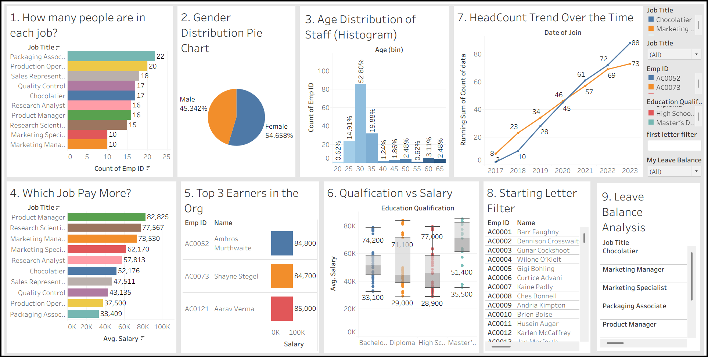

# 📊 Tableau HR Analytics Dashboard

> Advanced Tableau visualization project analyzing HR data with comprehensive interactive dashboards

[](https://www.tableau.com/)
[](https://www.microsoft.com/excel)
[](https://public.tableau.com)

## 🚀 **Live Interactive Dashboard**

> **Experience the dashboard live!** Click the links below to interact with the actual Tableau dashboard online.

### 📊 **Main Dashboard**
[](https://public.tableau.com/views/HRDataAnalysis_17555972332030/Story?:language=en-GB&:sid=&:redirect=auth&:display_count=n&:origin=viz_share_link)

### 📈 **Individual Worksheets**
- [📊 Job Distribution Analysis](https://public.tableau.com/views/HRDataAnalysis_17555972332030/Howmanypeopleareineachjob?:language=en-GB&:sid=&:display_count=n&:origin=viz_share_link)
- [👥 Gender Demographics](https://public.tableau.com/views/HRDataAnalysis_17555972332030/GenderDistributionPieChart?:language=en-GB&:sid=&:display_count=n&:origin=viz_share_link)
- [📈 Salary Analysis](https://public.tableau.com/views/HRDataAnalysis_17555972332030/WhichJobPayMore?:language=en-GB&:sid=&:display_count=n&:origin=viz_share_link)
- [🎯 Performance Metrics](https://public.tableau.com/views/HRDataAnalysis_17555972332030/Top3EarnersintheOrganisation?:language=en-GB&:sid=&:display_count=n&:origin=viz_share_link)
- [📊 Complete Dashboard View](https://public.tableau.com/views/HRDataAnalysis_17555972332030/Dashboard?:language=en-GB&:sid=&:display_count=n&:origin=viz_share_link)

### 📱 **Mobile-Friendly View**
[](https://public.tableau.com/views/HRDataAnalysis_17555972332030/Story?:language=en-GB&:sid=&:redirect=auth&:display_count=n&:origin=viz_share_link&:device=phone)

---

## 🎯 Project Overview

This project demonstrates advanced Tableau visualization techniques applied to Human Resources analytics. Through interactive dashboards, we explore employee demographics, compensation patterns, and organizational insights using real HR data.



## 📊 Interactive Dashboard Demo

### Complete Dashboard Exploration


### Story Mode Navigation


## 🛠️ Technologies & Tools

- **Tableau Desktop** - Advanced data visualization and analytics
- **Microsoft Excel** - Data source and preprocessing
- **HR Analytics** - Workforce insights and metrics
- **Multiple Chart Types** - Bar, pie, histogram, box plot, line charts
- **Interactive Dashboards** - Dynamic filtering and cross-visualization

## 📁 Project Structure

```
Tableau-HR-Analytics/
├── 📊 Complete_Dashboard.twbx           # Tableau packaged workbook
├── 📈 hr-data-analysis.xlsx             # HR dataset
├── 📋 HR Dataset Insights Worksheets.pdf# Analysis documentation
├── 📂 Images/                           # Visualization screenshots
│   ├── Dashboard.png                    # Main dashboard overview
│   ├── 1. How many people are in each job.png
│   ├── 2 Gender Distribution Pie Chart.png
│   ├── 3 Age Distribution of Staff (Histogram).png
│   ├── 4 Which Job Pay More.png
│   ├── 5 Top 3 Earners in the Organisation.png
│   ├── 6 Qualification vs Salary (Boxplot).png
│   ├── 7 Head Count Trend over the years (Male vs Female).png
│   ├── 8 Starting Letter Filte.png
│   └── 9 Leave Balance Analysis.png
├── 📂 Videos/                           # Demo GIF recordings
│   ├── Tableau Dashboard Exploration Part-1.gif
│   ├── Tableau Dashboard Exploration Part-2.gif
│   ├── Tableau Dashboard Story Part-1.gif
│   └── Tableau Dashboard Story Part-2.gif
├── 📂 extras/                           # Development files and alternatives
├── 📂 .github/                          # GitHub templates and workflows
├── 📖 README.md                         # This documentation
├── 📝 CONTRIBUTING.md                   # Contribution guidelines
├── 🛡️ SECURITY.md                       # Security policy
├── ⚖️ LICENSE                           # MIT license
├── 📋 CHANGELOG.md                      # Version history
└── 🚫 .gitignore                        # Git exclusions
```

## 📈 Comprehensive Visualization Analysis

### 1. Job Title Distribution Analysis
**Objective**: Understand workforce composition by job roles


**Implementation**:
- **Bar Chart**: Count of employees per job title
- **Configuration**: 
  - Drag `Emp ID` to columns (set measure to count)
  - Drag `Job Title` to rows and color
  - Sort by descending count
- **Insights**: Identifies most common positions and organizational structure

### 2. Gender Distribution Analysis
**Visualization**: Pie Chart for gender demographics


**Key Features**:
- **Setup**: Use Pie Chart from Show Me panel
- **Configuration**: `Emp ID` (count) to angle, `Gender` to color and label
- **Business Value**: Gender diversity tracking and inclusion metrics

### 3. Age Distribution Analysis
**Visualization**: Histogram showing workforce age patterns


**Technical Details**:
- **Implementation**: Create age bins with 5-year intervals
- **Insights**: 
  - Identifies age ranges and distribution patterns
  - Supports workforce diversity analysis
  - Assists in retirement planning and succession insights

### 4. Compensation Analysis
**Visualization**: Bar chart highlighting salary patterns


**Analysis Focus**:
- **Objective**: Identify highest paying positions
- **Configuration**: Average salary by job title, sorted descendingly
- **Filter**: Shows top 3 highest paying jobs
- **Business Value**: Compensation benchmarking and budget planning

### 5. Top Performers Identification

#### Overall Organization Top Earners


#### Department-wise Top Earners (Product Manager Example)


**Strategic Purpose**: Performance recognition and compensation benchmarking across different organizational levels

### 6. Education vs Compensation Analysis
**Visualization**: Box Plot showing qualification impact on salary


**Analysis Components**:
- **Elements**: Quartiles, median, outliers representation
- **Insights**:
  - Salary ranges by qualification level
  - Education ROI analysis
  - Identifies outliers in compensation structure

### 7. Workforce Growth Trends
**Visualization**: Dual-line graph tracking hiring patterns


**Trend Analysis**:
- **Male vs Female**: Separate trend lines for gender-based analysis
- **Time Series**: Historical hiring patterns and workforce growth
- **Strategic Value**: Gender diversity tracking and hiring trend analysis

### 8. Interactive Employee Directory
**Feature**: Dynamic filtering system for employee search


**Implementation Details**:
- **Calculated Field**: `LEFT([Name], 1)` for first letter extraction
- **Interactive Filter**: Dropdown selection by name's starting letter
- **Use Case**: HR system organization and efficient employee lookup

### 9. Work-Life Balance Analysis
**Visualization**: Leave balance patterns across organization


**Analysis Framework**:
- **Breakdown**: Leave balance by job title and gender
- **Calculated Field**: High/Low leave balance categorization  
- **Insights**: Work-life balance patterns and leave utilization trends

## 🔧 Technical Implementation Guide

### Data Connection & Preparation
```tableau
1. Connect to hr-data-analysis.xlsx
2. Verify data types (date, number, string)
3. Handle missing values and inconsistencies
4. Create calculated fields for derived metrics
```

### Step-by-Step Worksheet Creation

#### Job Distribution Bar Chart
```tableau
• Drag Emp ID → Columns (Count)
• Drag Job Title → Rows + Color
• Sort by Count(Emp ID) Descending
• Add Count(Emp ID) to Label
```

#### Gender Distribution Pie Chart
```tableau
• Select Pie Chart from Show Me
• Drag Emp ID → Angle (Count)
• Drag Gender → Color + Label
• Apply Percent of Total calculation
```

#### Age Distribution Histogram
```tableau
• Right-click Age → Create Bins (5 years)
• Drag Age (bin) → Columns
• Drag Emp ID → Rows (Count)
• Add Age (bin) to Color
```

#### Salary Analysis
```tableau
• Drag Salary → Rows (Average)
• Drag Job Title → Columns + Color
• Apply Top 3 filter by Average Salary
• Sort Descending
```

#### Top Performers Analysis
```tableau
• Drag Salary → Columns
• Drag Name → Rows
• Apply Job Title filter (Add to Context)
• Sort by Salary Descending
• Apply Top N filter
```

#### Education vs Salary Box Plot
```tableau
• Select Box Plot from Show Me
• Drag Education Qualification → Columns + Color
• Drag Salary → Rows
• Add Name + Emp ID to Detail
```

#### Headcount Trend Analysis
```tableau
• Select Line Chart
• Drag Date of Join (Year) → Columns
• Drag Emp ID (Count) → Rows
• Drag Gender → Color
```

#### Interactive Name Filter
```tableau
• Create Calculated Field: LEFT([Name], 1)
• Drag to Filters → Show as Dropdown
• Apply to employee details table
```

#### Leave Balance Analysis
```tableau
• Drag Job Title + Gender → Rows
• Drag Leave Balance → Text (Count)
• Create Calculated Field: IF [Leave Balance]>20 THEN 1 ELSE 0 END
• Apply as filter and color coding
```

## 🎨 Dashboard Design & Integration

### Professional Layout Features
- **Tiled Layout**: Clean, organized visual structure
- **Consistent Styling**: Unified color scheme and typography
- **Interactive Filters**: Cross-dashboard filtering capabilities
- **Responsive Design**: Optimized for various screen sizes

### Advanced Dashboard Features
- **Cross-filtering**: Click interactions between visualizations
- **Parameter Controls**: Dynamic analysis adjustments
- **Drill-down Capabilities**: Detailed analysis on demand
- **Export Ready**: PDF and image export optimization

## 📊 Key Business Insights

### Workforce Analytics Findings
- **Demographics**: Balanced gender distribution with slight female majority
- **Age Profile**: Predominantly young workforce in 25-35 age bracket
- **Compensation**: Product Managers and specialized roles command highest salaries
- **Growth Pattern**: Steady workforce expansion with recent hiring activity
- **Work-Life Balance**: Senior positions show higher leave utilization

### Strategic Business Implications
- **Talent Management**: Data-driven recruitment and retention strategies
- **Compensation Equity**: Transparent salary structure analysis
- **Diversity & Inclusion**: Comprehensive gender and age diversity tracking
- **Resource Planning**: Informed staffing and budget allocation decisions

## 🚀 Getting Started

### Prerequisites
- Tableau Desktop (2020.1 or later recommended)
- Access to the HR dataset (`hr-data-analysis.xlsx`)

### Quick Start Guide
1. **Download**: Clone or download this repository
2. **Open Tableau**: Launch Tableau Desktop
3. **Load Workbook**: Open `Complete_Dashboard.twbx`
4. **Explore Data**: Navigate through worksheets and dashboard
5. **Interact**: Use filters and parameters for dynamic analysis

### Customization Options
- **Corporate Branding**: Update colors and fonts to match organization
- **Extended Metrics**: Add custom calculated fields for specific analysis
- **Additional Filters**: Include more demographic or performance dimensions
- **Advanced Analytics**: Implement forecasting, clustering, or statistical analysis

## 📈 Advanced Features & Techniques

### Calculated Fields Examples
```tableau
# Age Grouping
IF [Age] < 30 THEN "Under 30" 
ELSEIF [Age] < 40 THEN "30-40" 
ELSE "40+" END

# Salary Banding
IF [Salary] < 50000 THEN "Entry Level" 
ELSEIF [Salary] < 80000 THEN "Mid Level" 
ELSE "Senior Level" END

# Tenure Calculation
DATEDIFF('year', [Date of Join], TODAY())

# Performance Scoring
([Salary] - AVG([Salary])) / STDEV([Salary])
```

### Interactive Design Elements
- **Dynamic Titles**: Context-aware chart headings
- **Conditional Formatting**: Performance-based color coding
- **Reference Lines**: Benchmark and target indicators
- **Rich Tooltips**: Comprehensive hover information

## 🎯 Best Practices Implementation

### Data Visualization Standards
- **Clear Hierarchy**: Logical information organization
- **Consistent Styling**: Maintained visual coherence
- **Purposeful Color Usage**: Enhanced understanding through color
- **Accessibility**: Readable design for all users

### Performance Optimization
- **Efficient Calculations**: Optimized calculated field performance
- **Appropriate Aggregation**: Proper data aggregation levels
- **Strategic Filtering**: Context filters for enhanced performance
- **Data Source Optimization**: Clean, well-prepared datasets

## 🔗 Learning Resources

### Tableau Learning Path
- [Official Tableau Training](https://www.tableau.com/learn)
- [HR Analytics Best Practices](https://www.tableau.com/solutions/hr-analytics)
- [Data Visualization Guidelines](https://help.tableau.com/current/pro/desktop/en-us/visual_best_practices.htm)

### Community Resources
- [Tableau Community Forums](https://community.tableau.com/)
- [Tableau Public Gallery](https://public.tableau.com/gallery)
- [HR Analytics Inspiration](https://public.tableau.com/search/vizzes/hr%20analytics)

## 🌐 Hosting Your Dashboard Online

Want to host this dashboard online? Check out our comprehensive hosting guide:

### **Quick Hosting Options**
- **[📖 Complete Hosting Guide](HOSTING_GUIDE.md)** - Step-by-step instructions
- **[🚀 Tableau Public](https://public.tableau.com)** - Free online hosting (recommended)
- **[📄 GitHub Pages Template](index.html)** - Ready-to-use HTML template

### **Live Dashboard Setup**
1. **Anonymize your HR data** (remove personal information)
2. **Publish to Tableau Public** (free account required)
3. **Update the placeholder links** in README.md
4. **Optional**: Use GitHub Pages for custom hosting

> **Note**: Once you publish to Tableau Public, update the placeholder links in the "Live Interactive Dashboard" section above with your actual dashboard URLs.

## 📋 Data Privacy & Ethics

### Privacy Considerations
- **Data Anonymization**: Personal information protection
- **Access Controls**: Appropriate data visibility restrictions
- **Compliance**: HR data regulation adherence
- **Secure Handling**: Proper data storage and transmission

## 📜 License & Usage

This project is developed for educational and demonstration purposes. When implementing similar analytics in your organization, ensure compliance with:
- Local data privacy regulations
- Company HR data policies
- Employee consent requirements
- Data retention guidelines

---

**Project Details**  
**Created**: August 2025 | **Course**: Tools and Practices for Data Science  
**Institution**: IIIT Nagpur | **Focus**: Advanced Tableau Analytics

*This project showcases professional-level HR analytics dashboard development using advanced Tableau visualization techniques and best practices in data storytelling.*
